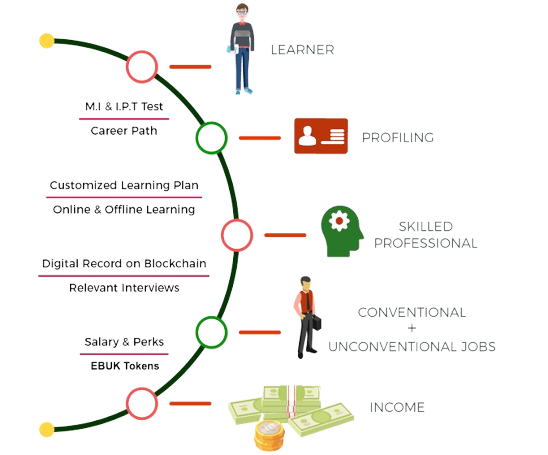

# Edubuk’s AI-Driven Holistic Skilling Ecosystem 

Edubuk is at the forefront of revolutionizing the educational landscape by integrating advanced Artifi- cial Intelligence (AI) technologies with the immutable power of blockchain. The platform’s AI-driven holistic skilling ecosystem is designed to provide a comprehensive, personalized, and transparent learning experience that adapts to the needs of each individual learner. 
### Personalized Learning Paths 

Through the use of sophisticated AI algorithms, Edubuk identifies the unique strengths, weaknesses, and learning styles of each student. This enables the platform to create tailored learning paths that optimize skill acquisition and ensure that each learner is progressing at a pace that suits them best. The AI continually assesses learner performance, providing real-time feedback and adjusting the curriculum as needed to maintain engagement and maximize outcomes.

### Skill Validation and Credentialing 
Blockchain technology plays a crucial role in Edubuk’s ecosystem by ensuring the integrity and security of the credentials earned by learners. Each skill acquired and every certification completed is recorded on the blockchain, creating a tamper-proof record of achievement. This not only enhances the credibility of the credentials but also provides employers and educational institutions with a transparent and easily verifiable record of a candidate’s skills and accomplishments. 

### Decentralized and Transparent Ecosystem 

The integration of blockchain ensures that Edubuk’s skilling ecosystem remains decentralized and transparent. All transactions, including skill certifications, course completions, and learning achievements, are recorded on the blockchain, ensuring that they are secure and cannot be altered. This transparency builds trust among learners, educators, and employers by eliminating any possibility of fraud or misrepresentation.
 
### AI-Driven Insights and Analytics 

Edubuk’s AI capabilities extend beyond personalized learning paths to provide educators and institutions with deep insights into learner performance and engagement. By analyzing vast amounts of data, the AI generates detailed analytics that can be used to improve course content, identify areas where students may need additional support, and predict future learning trends. These insights help in creating a more effective and responsive educational environment. 

### Bridging the Skills Gap 
One of the key goals of Edubuk’s AI-driven ecosystem is to bridge the skills gap that exists in various industries. By providing learners with the exact skills needed in the job market and validating those skills on the blockchain, Edubuk ensures that its users are not only well-educated but also highly employable.The platform’s focus on holistic skilling means that learners are equipped not just with technical knowledge, but also with soft skills, critical thinking, and problem-solving abilities that are essential in today’s dynamic work environments.

### Structured Skilling Process 
Edubuk’s ecosystem follows a structured process to ensure effective skill development and career  advancement: 

**1. MIIT Test (Career Path):**

The journey begins with the **Multiple Intelligence and Interest Test (MIIT)**, a comprehensive assessment designed to identify the learner’s optimal career path. This test evaluates cognitive abilities, interests, and potential, laying a solid foundation for personalized career guidance. 

**2. Profiling:**
 
Following the MIIT test, an in-depth profiling process captures the learner’s strengths, weaknesses, 
and potential growth areas. This detailed profile serves as the blueprint for crafting their customized 
learning journey. 
**3. Customized Learning Plan:**

Based on the profiling insights, a tailored learning plan is developed, integrating both online and 
offline learning modules. This dynamic plan adapts continuously to the learner’s progress, ensuring 
the acquisition of skills most relevant to their chosen career path. 
**4. Skilled Professional:** 

As learners progress through their personalized learning plans, they evolve into skilled professionals 
equipped with the necessary competencies and expertise required for success in their selected 
careers. 

**5. Digital Record on Blockchain:**
 
Every achievement, skill acquisition, and certification is securely recorded on the blockchain, creating 
an immutable and transparent digital record. This ensures all credentials are easily verifiable and trusted by potential employers and academic institutions. 

**6. Relevant Interviews:**

With a robust skill set and verified digital credentials, learners are matched with relevant job opportunities. AI-driven matchmaking connects them with employers seeking their specific skills across various industries and roles. 

**7. Conventional/Unconventional Jobs:**

The ecosystem supports both traditional career paths and emerging job markets, offering learners flexibility and a broad spectrum of opportunities to apply their skills in diverse and innovative fields.
 
**8. Salary & Perks (EBUK Token):**

Upon securing employment, salaries and perks are administered using **EBUK tokens**, the native 
digital currency of the Edubuk ecosystem. This facilitates seamless, secure, and efficient financial transactions and rewards within the platform. 

**9. Income Definition:**

Income within the Edubuk ecosystem is a dynamic reflection of the learner’s ongoing contributions and professional growth. A **Weighted Average Scoring System for CVs** employs advanced data analytics to assign scores to profile-specific KPIs, ensuring fair and performance-based income assessments. 

This comprehensive and technologically advanced approach ensures that learners are not only educated but also empowered with verified skills and credentials that are highly valued in the modern workforce. Edubuk’s integration of AI and blockchain technologies sets a new standard for education and professional development, fostering a future-ready generation of professionals. 
