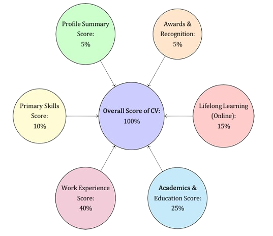

# Proposed-Solution

### AI-Driven MIIT Screening 
The Multiple Intelligences and Interests Types (MIIT) Screening employs a sophisticated AI-driven approach to career guidance by integrating psychometric assessments with advanced machine learning algorithms. This system maps an individual’s cognitive abilities, emotional intelligence, and interests to identify optimal career paths. AI algorithms utilize extensive data sets to uncover complex patterns that traditional methods fail to detect, delivering highly accurate career recommendations. The AI-driven MIIT screening process is implemented using the following algorithm: 
 
**Algorithm 1** AI-Driven MIIT Screening 
 
- **Input:** Psychometric Test Results P , Cognitive Data C, Emotional Data E 
- **Output:** Career Path CP 
- Calculate intelligence quotient IQ from C 
- Analyze emotional stability ES from E 
- Match IQ and ES with career paths in database D 
- Generate CP based on highest compatibility **return** CP

### Know the Learner 
In Edubuk’s AI-Driven Holistic Skilling Ecosystem, the journey of a learner is meticulously crafted to ensure optimal career alignment and skill development. It all begins with a comprehensive understanding of the learner’s profile, powered by advanced AI algorithms. The weights assigned to these KPIs can be customized, ensuring that the CV reflects the most relevant and impactful skills. This approach provides a more accurate and comprehensive view of the learner’s value in the job market, enabling better salary negotiations and career advancement. Through this AI-driven, blockchain-secured approach, Edubuk empowers learners to navigate their career paths with confidence, transparency, and efficiency, ensuring they are well-prepared for the future of work. 
### Career Path and Professional Development
- **MIIT Test (Career Path):** 
    
    The first step involves the MIIT (Multiple Intelligence and Interest Test), a sophisticated assessment designed to identify the learner’s career path. This test evaluates cognitive abilities, interests, and potential, laying the foundation for personalized career guidance. 
- **Profiling:** 
 
    Following the MIIT test, an in-depth profiling process captures the learner’s strengths, weaknesses, and potential growth areas. This profile serves as the blueprint for their customized learning journey. 
- **Customized Learning Plan:**
 
    Based on the profiling, a tailored learning plan is created, integrating both online and offline learning modules. This plan is continuously updated to adapt to the learner’s progress, ensuring they acquire the skills most relevant to their career path. 

- **Skilled Professional:**
 
    As learners progress through their personalized learning plans, they evolve into skilled professionals equipped with the necessary competencies for their chosen careers.
 
- **Digital Record on Blockchain:** 
 
    Every achievement, skill acquisition, and certification is securely recorded on the blockchain, creating an immutable and transparent digital record. This ensures that all credentials are verifiable and trusted by potential employers. 

- **Relevant Interviews:**

    With a solid skill set and verified digital credentials, learners are matched with relevant job opportunities. AI-driven matchmaking connects them with employers seeking their specific skills, whether for conventional or unconventional roles. 

- **Conventional/Unconventional Jobs:** 
 
    The ecosystem supports both traditional career paths and emerging job markets, offering flexibility and broader opportunities for learners to apply their skills in diverse industries. 

- **Salary & Perks (EBUK Token):**
 
    Upon securing a job, salary and perks are administered using EBUK tokens, the native digital currency of the Edubuk ecosystem. This allows for seamless transactions and rewards within the platform.

